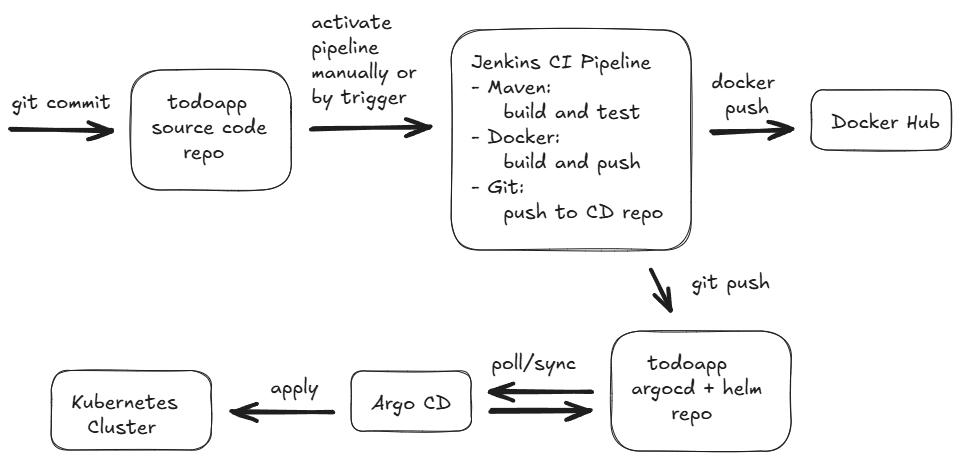

# todoapp

---
<details>
<summary><u>Simple CRUD app based on Spring Boot and Thymeleaf</u></summary>
<br>
JDK 17 <br>
Postgres 15.0 <br>
Tomcat 10.1
</details>

### Standalone deployment
Requirements:

- Docker & Docker Compose

```
Clone repository

Run:
1. cd todoapp

2. mvn clean package

3. docker compose -f todoapp-compose.yaml up -d --build
```

### CI Pipeline

<details>
<summary><u>Jenkins</u></summary>
<br>
Default recommended plugins <br>
Pipeline Utility Steps plugin <br>
ssh-agent plugin
</details>



### Prometheus

Add to Prometheus config:
```
# replace app_host:app_port with valid address 
  - job_name: 'spring-boot'
    metrics_path: '/actuator/prometheus'
    scrape_interval: 15s
    static_configs:
      - targets: ["app_host:app_port"]
```


